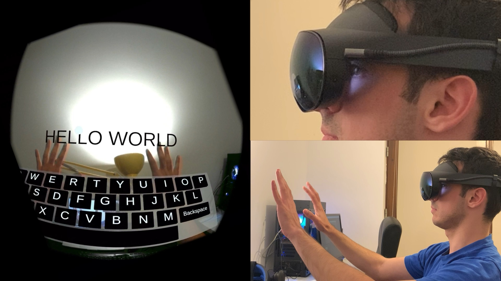
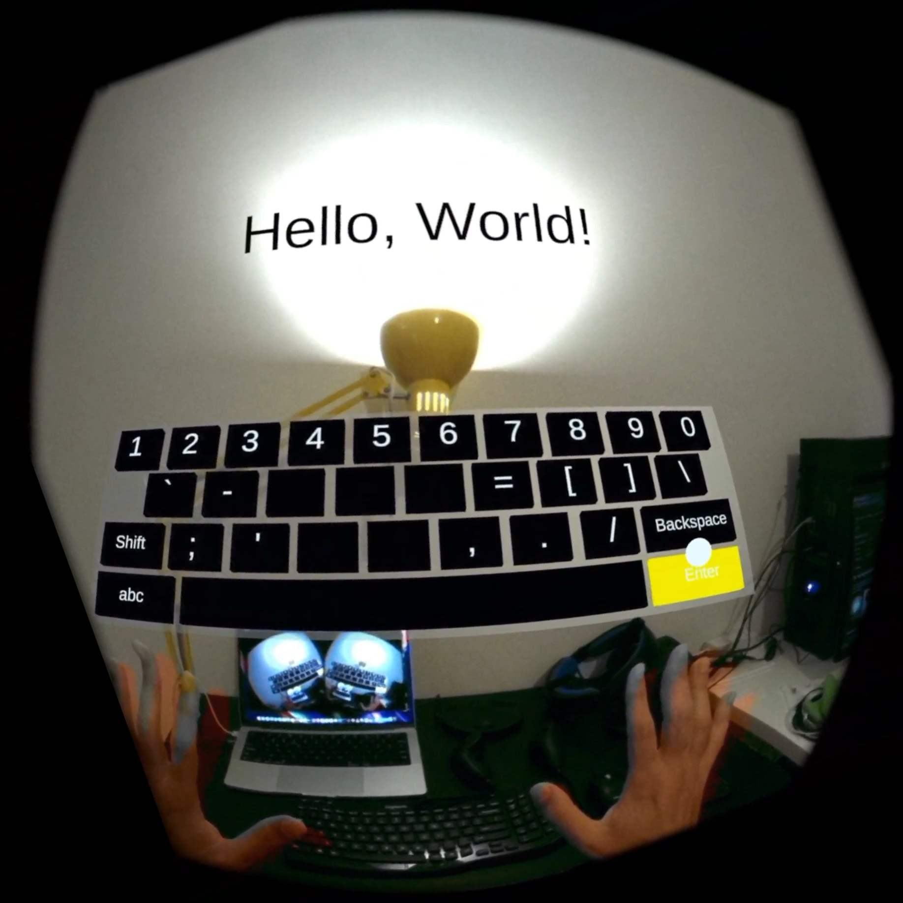
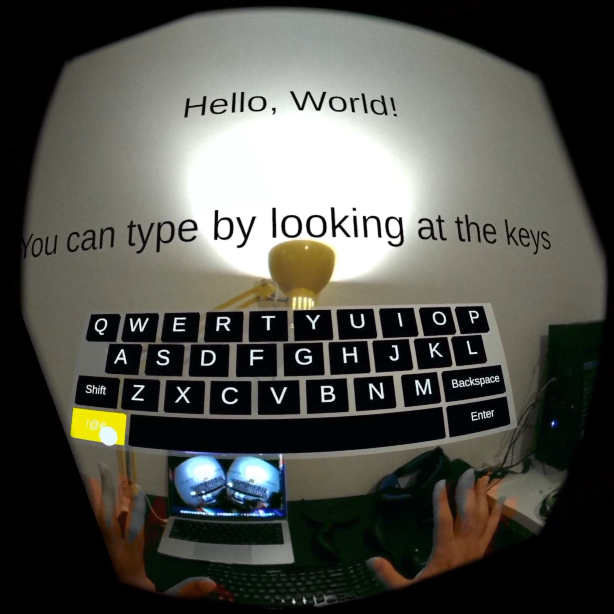
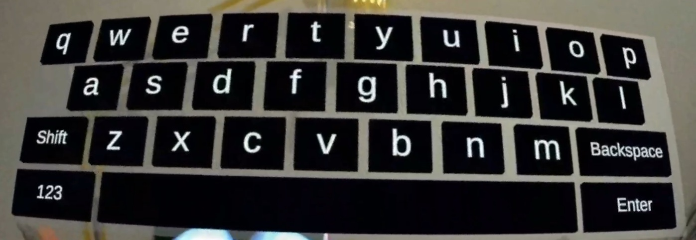
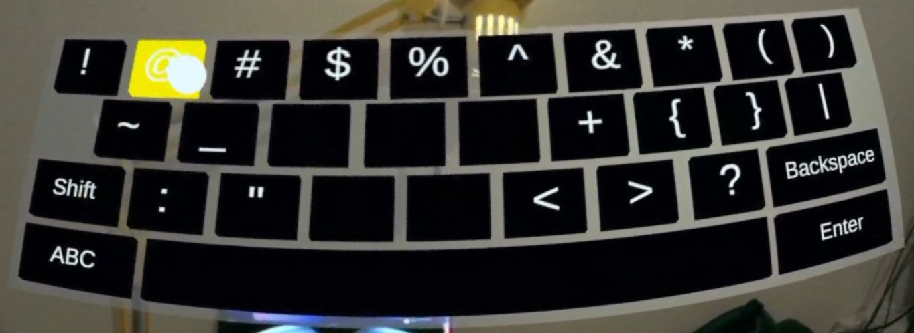

# Eye Tracking Keyboard

This is a simple prototype of a virtual keyboard that allows users to type on it using the Quest Pro's eye tracking. In other words, you can type by only looking at the keys.

## Videos

## Screenshots

## Requirements

 - Meta Quest Pro with Eye Tracking enabled.
 
 - [SideQuest](https://sidequestvr.com)

## How to install?

- Follow [these instructions](https://sidequestvr.com/setup-howto) to install SideQuest and setup your Meta Quest Pro for development.

- [Download the latest APK](https://github.com/fabio914/EyeTrackingKeyboard/releases/latest/download/build.apk).

- Connect your Meta Quest Pro to your computer, launch SideQuest and drag the APK to the top left corner of SideQuest to install it.

Alternatively, you can download and install the app directly from SideQuest [here](https://sidequestvr.com/app/11786/eye-tracking-keyboard-prototype).

## How to build?

 - Make sure you have Unity 2021.3 LTS installed (with Android Build support).

 - Clone this project.

 - Open the project with Unity, then open the Package Manager, and import the Oculus Integration package (version 46.0) and TextMesh Pro.

 - Navigate to **File > Build Settings...**, select the **Android** platform, then select your Meta Quest Pro as the **Run device** (if it's plugged in) and then click on **Build and Run**.
